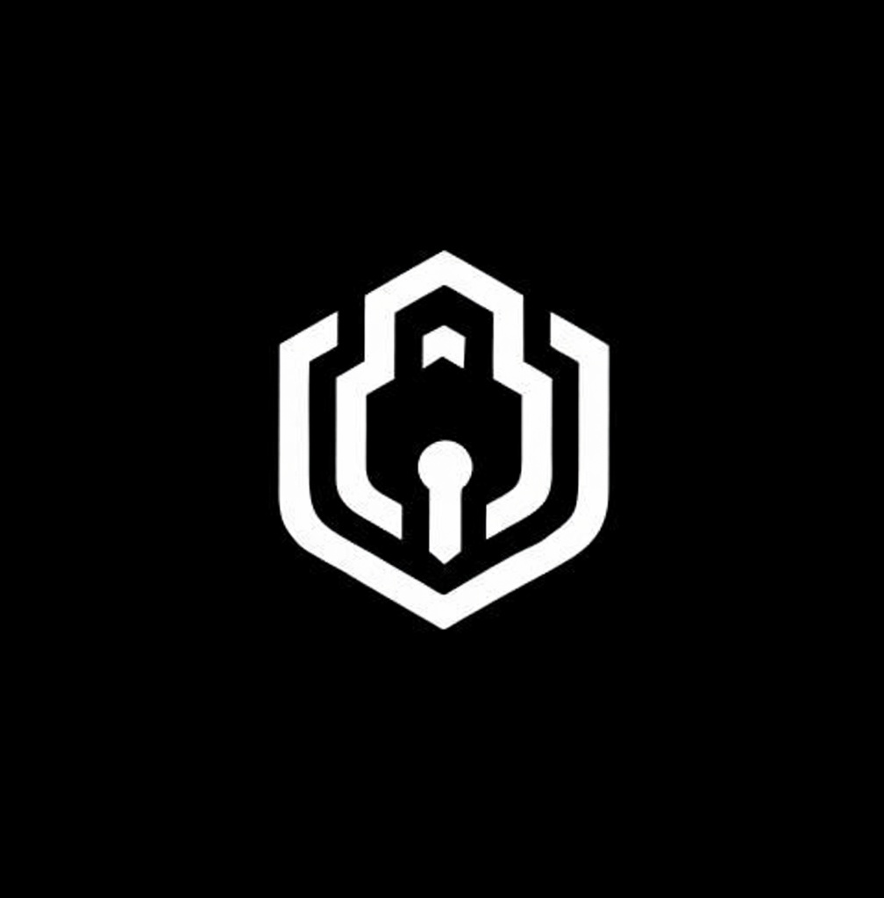

# AVUS-RN

<p align="center">
  
</p>

# AI-Powered Web3 Wallet

AVUS is an intelligent crypto wallet that combines secure digital payments,
AI assistance, and modern mobile banking into one seamless experience.

Built for the **UXmaxx Hackathon 2026**.

---

# Features

- AI Assistant (FAN)
- Voice-first wallet interaction
- QR Payments
- Send & Receive Crypto
- Beautiful modern UI
- Secure Authentication
- Face ID / Fingerprint
- PIN Protection
- Transaction History
- Multi-screen onboarding
- Floating AI Assistant
- Dark Mode
- Cross Platform (iOS & Android)

---

# Screens

- Splash
- Onboarding
- Authentication
- Home
- Activity
- Send
- Receive
- QR Scanner
- AI Assistant
- Settings
- Lock Screen

---

# Technology Stack

React Native

Expo

TypeScript

Expo Router

Zustand

React Native Reanimated

Gesture Handler

Expo Camera

Expo Secure Store

Expo Local Authentication

Lucide Icons

---

# Project Structure

```
app/
src/
 ├── components/
 ├── hooks/
 ├── services/
 ├── store/
 ├── utils/
 ├── constants/
assets/
```

---

# Installation

```bash
git clone https://github.com/marvelwilson/AVUS-RN.git

cd AVUS-RN

npm install

npx expo start
```


---

# Demo

Presentation

(Add Encode presentation link)

# Team

Marvel Marvelous Wilson Ighodaro

Founder & Lead Engineer

---

# Status

🚧 Hackathon MVP

This repository contains the hackathon version of AVUS.

Additional features are currently under development.

---

# Intellectual Property

This repository is publicly available for hackathon judging only.

The AVUS name, branding, user interface, architecture, AI assistant (FAN),
design assets, and source code remain the intellectual property of the author.

Commercial use, redistribution, or reproduction without permission is prohibited.

---

# Contact

GitHub

https://github.com/marvelwilson


Email

marvelwilsononit@gmail.com

---

Made with ❤️.
